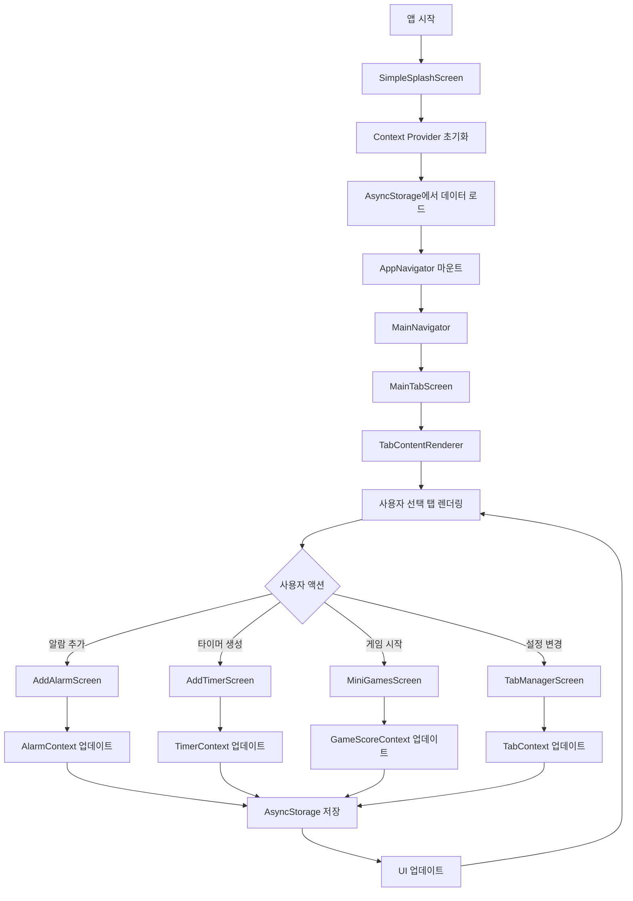
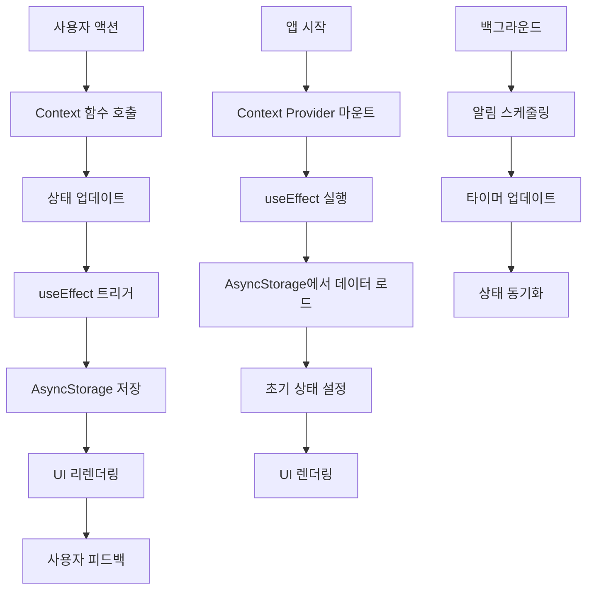

# 🏗️ RiseUp React Native 앱 완전 개발문서

## 📋 프로젝트 개요

**프로젝트명**: RiseUp - 다기능 알람 및 타이머 앱  
**개발 기간**: 2024년7월 ~ 현재  
**개발 언어**: TypeScript, JavaScript  
**플랫폼**: React Native (iOS/Android)  
**프로젝트 규모**: 중형 (50+ 컴포넌트, 20+ 화면)  
**주요 기능**: 알람, 타이머, 스톱워치, 미니게임, 유틸리티 도구

---

## 🔄 앱 실행 흐름도 (Flow Chart)



---

## 📁 핵심 파일별 코드 분석

### 1. App.tsx - 앱 진입점

**역할**: 앱의 최상위 컴포넌트 및 Context Provider 설정

**주요 코드 흐름**:
```typescript
function App(): React.JSX.Element {
  const [showSplash, setShowSplash] = useState(true);
  
  // Context Provider 계층 구조
  return (
    <SafeAreaProvider>
      <StatusBar />
      <ThemeProvider>
        <AlarmProvider>
          <TimerProvider>
            <IntervalProvider>
              <TabProvider>
                <GameScoreProvider>
                  {showSplash ? (
                    <SimpleSplashScreen onAnimationEnd={handleSplashEnd} />
                  ) : (
                    <AppNavigator />
                  )}
                </GameScoreProvider>
              </TabProvider>
            </IntervalProvider>
          </TimerProvider>
        </AlarmProvider>
      </ThemeProvider>
      <CustomAlert />
    </SafeAreaProvider>
  );
}
```

**핵심 특징**:
- Context Provider 중첩으로 상태 관리 계층화
- 스플래시 화면과 메인 앱 전환
- 전역 알림 시스템 통합

**코드 흐름**:
1. `useState`로 스플래시 화면 표시 상태 관리
2. `useEffect`로 GlobalAlert 핸들러 설정
3. Context Provider 계층 구조로 앱 전체 상태 관리
4. 스플래시 종료 시 메인 앱 네비게이션으로 전환

---

### 2. 네비게이션 시스템

#### 2.1 AppNavigator.tsx
**역할**: 최상위 네비게이션 컨테이너

```typescript
const AppNavigator = () => {
  return (
    <NavigationContainer>
      <MainNavigator />
    </NavigationContainer>
  );
};
```

**코드 흐름**:
1. React Navigation의 NavigationContainer로 앱 전체 네비게이션 래핑
2. MainNavigator를 하위 네비게이션으로 설정

#### 2.2 MainNavigator.tsx
**역할**: 메인 화면 네비게이션 및 탭 관리

**주요 코드 흐름**:
```typescript
const MainTabScreen = ({ navigation }) => {
  const { tabs, activeTab, setActiveTab, isLoading } = useTab();
  const insets = useSafeAreaInsets();
  
  // 탭 배열 안정화 (useMemo 사용)
  const updatedTabs = useMemo(() => {
    if (!tabs || tabs.length === 0) {
      return DEFAULT_TABS;
    }
    
    return tabs.map(tab => {
      if (!tab.component) {
        // 기본 탭 컴포넌트 매핑
        if (tab.id === 'Alarm') return { ...tab, component: HomeScreen };
        if (tab.id === 'Timer') return { ...tab, component: TimerScreen };
        // ... 기타 탭들
      }
      return tab;
    });
  }, [tabs, isLoading]);
  
  return (
    <View style={styles.container}>
      <View style={styles.contentContainer}>
        <TabContentRenderer 
          tabs={updatedTabs} 
          activeTab={activeTab} 
          navigation={navigation}
        />
      </View>
      <View style={styles.tabBarContainer}>
        <CustomTabBar
          tabs={updatedTabs}
          activeTab={activeTab}
          onTabChange={setActiveTab}
          onSettingsPress={handleSettingsPress}
          scrollable={true}
        />
      </View>
    </View>
  );
};
```

**핵심 특징**:
- 동적 탭 컴포넌트 매핑
- useMemo를 통한 성능 최적화
- 안전 영역(Safe Area) 고려한 레이아웃

**코드 흐름**:
1. `useTab` 훅으로 탭 상태 및 함수 가져오기
2. `useMemo`로 탭 배열 안정화 및 컴포넌트 매핑
3. `TabContentRenderer`로 활성 탭 콘텐츠 렌더링
4. `CustomTabBar`로 탭 네비게이션 UI 제공

---

### 3. Context 시스템

#### 3.1 TabContext.tsx
**역할**: 탭 네비게이션 상태 관리

**주요 코드 흐름**:
```typescript
export const TabProvider: React.FC<TabProviderProps> = ({ children }) => {
  const [tabs, setTabs] = useState<TabConfig[]>(DEFAULT_TABS);
  const [activeTab, setActiveTab] = useState<string>('Alarm');
  const [isLoading, setIsLoading] = useState(true);
  
  // 컴포넌트 매핑 함수
  const getComponentById = (id: string) => {
    const baseId = id.split('_')[0];
    
    switch (baseId) {
      case 'calculator': return CalculatorScreen;
      case 'notes': return NotesScreen;
      case 'flashlight': return FlashlightScreen;
      // ... 기타 컴포넌트들
      default: return null;
    }
  };
  
  // 탭 추가
  const addTab = (tab: TabConfig) => {
    const newTab = {
      ...tab,
      id: `${tab.id}_${Date.now()}`,
      component: getComponentById(tab.id)
    };
    
    setTabs(prev => [...prev, newTab]);
    saveTabsToStorage([...tabs, newTab]);
  };
  
  return (
    <TabContext.Provider value={{
      tabs,
      activeTab,
      setActiveTab,
      addTab,
      removeTab,
      reorderTabs,
      resetToDefault,
      isLoading
    }}>
      {children}
    </TabContext.Provider>
  );
};
```

**핵심 특징**:
- 동적 컴포넌트 로딩 시스템
- 타임스탬프 기반 고유 ID 생성
- AsyncStorage를 통한 상태 지속성

**코드 흐름**:
1. `useState`로 탭 배열, 활성 탭, 로딩 상태 관리
2. `useEffect`로 앱 시작 시 저장된 탭 데이터 로드
3. `getComponentById` 함수로 탭 ID에 따른 컴포넌트 매핑
4. `addTab`, `removeTab`, `reorderTabs` 함수로 탭 CRUD 작업
5. AsyncStorage를 통한 탭 데이터 영속성 보장

#### 3.2 AlarmContext.tsx
**역할**: 알람 관련 전역 상태 관리

**주요 코드 흐름**:
```typescript
export const AlarmProvider: React.FC<AlarmProviderProps> = ({ children }) => {
  const [alarms, setAlarms] = useState<Alarm[]>([]);
  const [alarmGroups, setAlarmGroups] = useState<AlarmGroup[]>(DEFAULT_ALARM_GROUPS);
  const [alarmHistory, setAlarmHistory] = useState<AlarmHistory[]>([]);
  const [isLoading, setIsLoading] = useState(true);
  
  // 알람 추가
  const addAlarm = async (time: Date, label?: string, repeatDays?: number[], soundId?: string, groupId?: string) => {
    try {
      const newAlarm: Alarm = {
        id: generateId(),
        time,
        label,
        repeatDays,
        soundId,
        groupId,
        isActive: true,
        priority: 'medium',
        tags: [],
        createdAt: new Date()
      };
      
      setAlarms(prev => [...prev, newAlarm]);
      await saveAlarmsToStorage([...alarms, newAlarm]);
      
      // 알람 스케줄링
      const success = await scheduleAlarm(newAlarm);
      return success;
    } catch (error) {
      console.error('알람 추가 실패:', error);
      return false;
    }
  };
  
  return (
    <AlarmContext.Provider value={{
      alarms,
      alarmGroups,
      alarmHistory,
      addAlarm,
      deleteAlarm,
      toggleAlarm,
      // ... 기타 함수들
    }}>
      {children}
    </AlarmContext.Provider>
  );
};
```

**핵심 특징**:
- 비동기 알람 스케줄링
- 그룹 기반 알람 분류
- 통계 및 히스토리 관리

**코드 흐름**:
1. `useState`로 알람, 그룹, 히스토리 상태 관리
2. `useEffect`로 앱 시작 시 저장된 알람 데이터 로드
3. `addAlarm` 함수로 새 알람 생성 및 스케줄링
4. AsyncStorage를 통한 데이터 영속성

#### 3.3 TimerContext.tsx
**역할**: 타이머 관련 전역 상태 관리

**주요 코드 흐름**:
```typescript
export const TimerProvider = ({ children }: { children: ReactNode }) => {
  const [timers, setTimers] = useState<Timer[]>([]);
  const [timerTemplates, setTimerTemplates] = useState<TimerTemplate[]>(DEFAULT_TIMER_TEMPLATES);
  const [timerHistory, setTimerHistory] = useState<TimerHistory[]>([]);
  const [timerCategories, setTimerCategories] = useState<TimerCategory[]>(DEFAULT_TIMER_CATEGORIES);
  const [isLoading, setIsLoading] = useState(true);
  
  // 실행 중인 타이머들 업데이트 (10ms마다)
  useEffect(() => {
    const interval = setInterval(() => {
      setTimers(prevTimers => 
        prevTimers.map(timer => {
          if (timer.isRunning && timer.remainingTime > 0) {
            const newRemainingTime = Math.max(0, timer.remainingTime - 10);
            
            if (newRemainingTime === 0) {
              // 타이머 완료
              handleTimerComplete(timer);
              return {
                ...timer,
                remainingTime: 0,
                isRunning: false,
                isCompleted: true
              };
            }
            
            return {
              ...timer,
              remainingTime: newRemainingTime
            };
          }
          return timer;
        })
      );
    }, 10);

    return () => clearInterval(interval);
  }, []);
  
  return (
    <TimerContext.Provider value={{
      timers,
      timerTemplates,
      timerHistory,
      timerCategories,
      addTimer,
      deleteTimer,
      startTimer,
      pauseTimer,
      resetTimer,
      // ... 기타 함수들
    }}>
      {children}
    </TimerContext.Provider>
  );
};
```

**핵심 특징**:
- 실시간 타이머 업데이트 (10ms 간격)
- 자동 완료 처리 및 알림
- 템플릿 및 카테고리 시스템

**코드 흐름**:
1. `useState`로 타이머, 템플릿, 히스토리, 카테고리 상태 관리
2. `useEffect`로 10ms마다 실행 중인 타이머 업데이트
3. `handleTimerComplete` 함수로 타이머 완료 시 알림 및 히스토리 기록
4. AsyncStorage를 통한 데이터 영속성

---

### 4. 화면 컴포넌트

#### 4.1 HomeScreen.tsx - 알람 메인 화면
**역할**: 알람 목록 표시 및 관리

**주요 코드 흐름**:
```typescript
const HomeScreen = ({ navigation }) => {
  const { alarms, deleteAlarm, toggleAlarm, isLoading, alarmGroups } = useAlarm();
  const [selectedFilter, setSelectedFilter] = useState<FilterType>('all');
  const [showFilters, setShowFilters] = useState(false);
  const [groupDropdownOpenId, setGroupDropdownOpenId] = useState<string | null>(null);
  
  // 필터링된 알람 목록
  const filteredAlarms = useMemo(() => {
    if (selectedFilter === 'all') {
      return alarms;
    }

    return alarms.filter(alarm => {
      const repeatDays = alarm.repeatDays || [];
      
      switch (selectedFilter) {
        case 'weekdays':
          return repeatDays.includes(1) && repeatDays.includes(2) && 
                 repeatDays.includes(3) && repeatDays.includes(4) && 
                 repeatDays.includes(5) && repeatDays.length === 5;
        case 'weekend':
          return repeatDays.includes(0) && repeatDays.includes(6) && 
                 repeatDays.length === 2;
        case 'daily':
          return repeatDays.length === 7;
        case 'once':
          return repeatDays.length === 0;
        // ... 기타 필터들
        default:
          return true;
      }
    });
  }, [alarms, selectedFilter]);
  
  return (
    <View style={styles.container}>
      {/* 필터 헤더 */}
      <View style={styles.filterHeader}>
        <TouchableOpacity onPress={() => setShowFilters(!showFilters)}>
          <Text style={styles.filterButton}>
            {currentFilter?.icon} {currentFilter?.label}
          </Text>
        </TouchableOpacity>
      </View>
      
      {/* 알람 목록 */}
      <FlatList
        data={filteredAlarms}
        keyExtractor={(item) => item.id}
        renderItem={({ item }) => (
          <AlarmItem
            alarm={item}
            onToggle={toggleAlarm}
            onDelete={deleteAlarm}
            onEdit={() => navigation.navigate('EditAlarm', { alarm: item })}
          />
        )}
        ListEmptyComponent={
          <View style={styles.emptyContainer}>
            <Text style={styles.emptyText}>알람이 없습니다</Text>
            <TouchableOpacity onPress={() => navigation.navigate('AddAlarm')}>
              <Text style={styles.addButton}>알람 추가하기</Text>
            </TouchableOpacity>
          </View>
        }
      />
      
      {/* FAB */}
      <TouchableOpacity
        style={styles.fab}
        onPress={() => navigation.navigate('AddAlarm')}
      >
        <Text style={styles.fabIcon}>+</Text>
      </TouchableOpacity>
    </View>
  );
};
```

**핵심 특징**:
- useMemo를 통한 필터링 최적화
- 그룹별 알람 분류
- 동적 필터링 시스템

**코드 흐름**:
1. `useAlarm` 훅으로 알람 상태 및 함수 가져오기
2. `useState`로 필터, 드롭다운 상태 관리
3. `useMemo`로 필터링된 알람 목록 및 그룹별 분류 최적화
4. `FlatList`로 알람 목록 렌더링
5. 필터 변경 시 자동으로 목록 업데이트

#### 4.2 StopwatchScreen.tsx - 스톱워치
**역할**: 스톱워치 기능 및 랩 타임 기록

**주요 코드 흐름**:
```typescript
const StopwatchScreen = React.memo(() => {
  const [time, setTime] = useState(0);
  const [isRunning, setIsRunning] = useState(false);
  const [laps, setLaps] = useState<LapTime[]>([]);
  const intervalRef = useRef<NodeJS.Timeout | null>(null);
  const flatListRef = useRef<FlatList>(null);
  
  // 타이머 인터벌 관리
  useEffect(() => {
    if (isRunning) {
      intervalRef.current = setInterval(() => {
        setTime(prevTime => prevTime + 10);
      }, 10);
    } else {
      if (intervalRef.current) {
        clearInterval(intervalRef.current);
        intervalRef.current = null;
      }
    }

    return () => {
      if (intervalRef.current) {
        clearInterval(intervalRef.current);
      }
    };
  }, [isRunning]);
  
  // 시간 포맷팅
  const formatTime = useCallback((timeMs: number) => {
    const minutes = Math.floor(timeMs / 60000);
    const seconds = Math.floor((timeMs % 60000) / 1000);
    const milliseconds = Math.floor((timeMs % 1000) / 10);

    return `${minutes.toString().padStart(2, '0')}:${seconds
      .toString()
      .padStart(2, '0')}.${milliseconds.toString().padStart(2, '0')}`;
  }, []);
  
  // 시작/정지 처리
  const handleStartStop = useCallback(() => {
    if (isRunning) {
      Vibration.vibrate(50);
    }
    setIsRunning(!isRunning);
  }, [isRunning]);
  
  // 랩/리셋 처리
  const handleLapReset = useCallback(() => {
    Vibration.vibrate(50);
    
    if (isRunning) {
      // 랩 타임 기록
      const lapTime: LapTime = {
        id: Date.now().toString(),
        time: time,
        lapNumber: laps.length + 1,
        difference: laps.length > 0 ? time - laps[laps.length - 1].time : time,
      };
      setLaps(prev => {
        const newLaps = [...prev, lapTime];
        // 새 랩이 추가되면 맨 위로 스크롤
        setTimeout(() => {
          flatListRef.current?.scrollToOffset({ offset: 0, animated: true });
        }, 100);
        return newLaps;
      });
    } else {
      // 리셋
      setTime(0);
      setLaps([]);
    }
  }, [isRunning, time, laps]);
  
  return (
    <View style={styles.container}>
      {/* 시간 표시 */}
      <View style={styles.timeContainer}>
        <Text style={styles.timeText}>{formatTime(time)}</Text>
      </View>
      
      {/* 컨트롤 버튼 */}
      <View style={styles.controlsContainer}>
        <TouchableOpacity
          style={[styles.controlButton, styles.lapResetButton]}
          onPress={handleLapReset}
        >
          <Text style={styles.controlButtonText}>
            {isRunning ? '랩' : '리셋'}
          </Text>
        </TouchableOpacity>
        
        <TouchableOpacity
          style={[styles.controlButton, styles.startStopButton]}
          onPress={handleStartStop}
        >
          <Text style={styles.controlButtonText}>
            {isRunning ? '정지' : '시작'}
          </Text>
        </TouchableOpacity>
      </View>
      
      {/* 랩 타임 목록 */}
      <FlatList
        ref={flatListRef}
        data={laps}
        keyExtractor={(item) => item.id}
        renderItem={({ item }) => (
          <View style={styles.lapItem}>
            <Text style={styles.lapNumber}>랩 {item.lapNumber}</Text>
            <Text style={styles.lapTime}>{formatTime(item.time)}</Text>
            {item.difference && (
              <Text style={styles.lapDifference}>
                {formatTime(item.difference)}
              </Text>
            )}
          </View>
        )}
        ListEmptyComponent={
          <View style={styles.emptyLapsContainer}>
            <Text style={styles.emptyLapsText}>랩 타임이 없습니다</Text>
          </View>
        }
      />
    </View>
  );
});
```

**핵심 특징**:
- React.memo를 통한 렌더링 최적화
- useCallback을 통한 함수 최적화
- 자동 스크롤 기능

**코드 흐름**:
1. `useState`로 시간, 실행 상태, 랩 타임 상태 관리
2. `useRef`로 인터벌 및 FlatList 참조 관리
3. `useEffect`로 실행 상태에 따른 타이머 인터벌 관리
4. `useCallback`으로 함수 참조 안정화
5. 랩 타임 추가 시 자동 스크롤 기능

#### 4.3 MiniGamesScreen.tsx - 미니게임
**역할**: 미니게임 선택 및 실행

**주요 코드 흐름**:
```typescript
const MiniGamesScreen = () => {
  const [selectedGame, setSelectedGame] = useState<string | null>(null);
  const [selectedScoreFilter, setSelectedScoreFilter] = useState<string>('all');
  const { gameScores, addScore } = useGameScore();
  
  // 게임 목록 정의
  const games = [
    {
      id: 'number',
      title: '숫자 맞추기',
      description: '1~100 사이의 숫자를 맞춰보세요',
      icon: '🔢',
      color: '#FF6B6B',
      component: NumberGuessGame
    },
    {
      id: 'reaction',
      title: '반응속도 테스트',
      description: '초록색이 나타나면 빠르게 터치하세요',
      icon: '⚡',
      color: '#4ECDC4',
      component: ReactionGame
    },
    // ... 기타 게임들
  ];
  
  // 게임 시작
  const startGame = (gameId: string) => {
    console.log('🎮 [메인] 게임 시작:', gameId);
    const game = games.find(g => g.id === gameId);
    
    if (!game?.component) {
      console.log('🚧 [메인] 게임 컴포넌트가 아직 분리되지 않음:', gameId);
      return;
    }
    
    setSelectedGame(gameId);
  };
  
  // 게임 종료 처리
  const handleGameEnd = (score: number) => {
    if (selectedGame) {
      addScore(selectedGame, score);
      setSelectedGame(null);
    }
  };
  
  if (selectedGame) {
    const game = games.find(g => g.id === selectedGame);
    const GameComponent = game?.component;
    
    if (GameComponent) {
      return (
        <View style={styles.gameContainer}>
          <TouchableOpacity
            style={styles.backButton}
            onPress={() => setSelectedGame(null)}
          >
            <Text style={styles.backButtonText}>← 뒤로</Text>
          </TouchableOpacity>
          <GameComponent onGameEnd={handleGameEnd} />
        </View>
      );
    }
  }
  
  return (
    <View style={styles.container}>
      {/* 게임 목록 */}
      <ScrollView contentContainerStyle={styles.gamesContainer}>
        {games.map((game) => (
          <TouchableOpacity
            key={game.id}
            style={[styles.gameCard, { backgroundColor: game.color }]}
            onPress={() => startGame(game.id)}
          >
            <Text style={styles.gameIcon}>{game.icon}</Text>
            <Text style={styles.gameTitle}>{game.title}</Text>
            <Text style={styles.gameDescription}>{game.description}</Text>
          </TouchableOpacity>
        ))}
      </ScrollView>
      
      {/* 점수 통계 */}
      <View style={styles.statsContainer}>
        <Text style={styles.statsTitle}>점수 통계</Text>
        <FlatList
          data={filteredScores}
          keyExtractor={(item) => item.id}
          renderItem={({ item }) => (
            <View style={styles.scoreItem}>
              <Text style={styles.scoreGame}>{item.gameId}</Text>
              <Text style={styles.scoreValue}>{item.score}</Text>
              <Text style={styles.scoreDate}>
                {new Date(item.timestamp).toLocaleDateString()}
              </Text>
            </View>
          )}
        />
      </View>
    </View>
  );
};
```

**핵심 특징**:
- 동적 게임 컴포넌트 로딩
- 점수 시스템 통합
- 게임별 통계 관리

**코드 흐름**:
1. `useState`로 선택된 게임 및 점수 필터 상태 관리
2. `useGameScore` 훅으로 게임 점수 상태 및 함수 가져오기
3. `games` 배열로 게임 목록 정의 및 컴포넌트 매핑
4. `startGame` 함수로 게임 시작 및 컴포넌트 전환
5. `handleGameEnd` 함수로 게임 종료 시 점수 기록

---

### 5. 커스텀 훅

#### 5.1 useGameState.ts
**역할**: 게임 상태 관리 공통 로직

**주요 코드 흐름**:
```typescript
export const useGameState = <T extends BaseGameState>({
  initialState,
  onGameEnd
}: UseGameStateProps<T>): UseGameStateReturn<T> => {
  const [gameState, setGameState] = useState<T>(initialState);
  
  const updateGameState = useCallback((updates: Partial<T>) => {
    console.log('🎮 [게임상태] 업데이트:', updates);
    setGameState(prev => {
      const newState = { ...prev, ...updates };
      
      // 게임이 종료되었는지 확인
      if (newState.gameOver && !prev.gameOver) {
        console.log('🎮 [게임상태] 게임 종료됨');
        if (onGameEnd) {
          onGameEnd(newState);
        }
      }
      
      return newState;
    });
  }, [onGameEnd]);
  
  const resetGame = useCallback((newState?: Partial<T>) => {
    console.log('🎮 [게임상태] 게임 리셋');
    const resetState = {
      ...initialState,
      ...newState
    };
    setGameState(resetState);
  }, [initialState]);
  
  const endGame = useCallback(() => {
    console.log('🎮 [게임상태] 강제 게임 종료');
    updateGameState({ gameOver: true } as Partial<T>);
  }, [updateGameState]);
  
  const isGameActive = !gameState.gameOver;
  
  return {
    gameState,
    updateGameState,
    resetGame,
    endGame,
    isGameActive
  };
};
```

**핵심 특징**:
- 제네릭을 통한 타입 안전성
- 게임 종료 자동 감지
- 상태 업데이트 로깅

**코드 흐름**:
1. 제네릭 타입 `T`로 다양한 게임 상태 타입 지원
2. `useState`로 게임 상태 관리
3. `useCallback`으로 함수 참조 안정화
4. `updateGameState` 함수로 상태 업데이트 및 게임 종료 감지
5. `resetGame` 함수로 게임 상태 초기화
6. `endGame` 함수로 강제 게임 종료

---

### 6. 유틸리티 함수

#### 6.1 storage.ts
**역할**: AsyncStorage 기반 데이터 저장/로드

**주요 코드 흐름**:
```typescript
// 알람 저장
export const saveAlarmsToStorage = async (alarms: Alarm[]): Promise<void> => {
  try {
    const jsonValue = JSON.stringify(alarms);
    await AsyncStorage.setItem(ALARMS_STORAGE_KEY, jsonValue);
  } catch (error) {
    console.error('Error saving alarms to storage:', error);
  }
};

// 알람 로드
export const loadAlarmsFromStorage = async (): Promise<Alarm[]> => {
  try {
    const jsonValue = await AsyncStorage.getItem(ALARMS_STORAGE_KEY);
    if (jsonValue != null) {
      const alarms = JSON.parse(jsonValue);
      // Date 객체 복원
      return alarms.map((alarm: any) => ({
        ...alarm,
        time: new Date(alarm.time),
      }));
    }
    return [];
  } catch (error) {
    console.error('Error loading alarms from storage:', error);
    return [];
  }
};

// 알람 그룹 저장
export const saveAlarmGroupsToStorage = async (groups: AlarmGroup[]): Promise<void> => {
  try {
    const jsonValue = JSON.stringify(groups);
    await AsyncStorage.setItem(ALARM_GROUPS_STORAGE_KEY, jsonValue);
    console.log('💾 알람 그룹 저장 완료:', groups.length);
  } catch (error) {
    console.error('❌ 알람 그룹 저장 실패:', error);
  }
};

// 알람 그룹 로드
export const loadAlarmGroupsFromStorage = async (): Promise<AlarmGroup[]> => {
  try {
    const groupsData = await AsyncStorage.getItem(ALARM_GROUPS_STORAGE_KEY);
    if (groupsData) {
      const groups = JSON.parse(groupsData);
      // Date 객체 복원
      const parsedGroups = groups.map((group: any) => ({
        ...group,
        createdAt: new Date(group.createdAt),
      }));
      console.log('📂 알람 그룹 로드 완료:', parsedGroups.length);
      return parsedGroups;
    }
    return [];
  } catch (error) {
    console.error('❌ 알람 그룹 로드 실패:', error);
    return [];
  }
};
```

**핵심 특징**:
- 에러 처리 및 로깅
- Date 객체 자동 복원
- 구조화된 로그 메시지

**코드 흐름**:
1. `AsyncStorage.setItem`으로 JSON 형태의 데이터 저장
2. `AsyncStorage.getItem`으로 저장된 데이터 로드
3. `JSON.parse`로 문자열을 객체로 변환
4. `map` 함수로 Date 객체 자동 복원
5. `try-catch`로 에러 처리 및 로깅

---

## 🔄 상태 관리 흐름도



---

## 🎯 성능 최적화 전략

### 1. 렌더링 최적화
- **React.memo**: 불필요한 리렌더링 방지
- **useMemo**: 계산 비용이 큰 값 메모이제이션
- **useCallback**: 함수 참조 안정화

### 2. 메모리 관리
- **useEffect 정리**: 타이머, 이벤트 리스너 정리
- **ref 사용**: DOM 요소 직접 접근
- **상태 분리**: 관련 없는 상태는 별도 Context로 분리

### 3. 데이터 최적화
- **지연 로딩**: 필요할 때만 데이터 로드
- **페이지네이션**: 대용량 데이터 분할 처리
- **캐싱**: 자주 사용되는 데이터 메모리 저장

---

## 🚀 향후 개선 방향

### 1. 단기 개선 (1-3개월)
- [ ] **성능 최적화**
  - [ ] React.memo 적용 범위 확대
  - [ ] useMemo/useCallback 최적화
  - [ ] 불필요한 리렌더링 제거
- [ ] **코드 품질**
  - [ ] TypeScript strict 모드 적용
  - [ ] 에러 바운더리 추가
  - [ ] 단위 테스트 작성

### 2. 중기 개선 (3-6개월)
- [ ] **아키텍처 개선**
  - [ ] Redux Toolkit 도입 검토
  - [ ] 마이크로 프론트엔드 패턴 적용
  - [ ] 상태 관리 최적화
- [ ] **사용자 경험**
  - [ ] 애니메이션 시스템 구축
  - [ ] 햅틱 피드백 추가
  - [ ] 다크/라이트 모드 전환

### 3. 장기 개선 (6개월 이상)
- [ ] **플랫폼 확장**
  - [ ] 웹 버전 개발
  - [ ] 데스크톱 앱
  - [ ] 웨어러블 지원
- [ ] **고급 기능**
  - [ ] AI 기반 추천 시스템
  - [ ] 클라우드 동기화
  - [ ] 소셜 기능

---

## 🎉 프로젝트 완료 및 향후 계획

이 문서는 RiseUp React Native 앱의 완전한 개발문서입니다. 각 파일의 코드별 내용, flow차트, 코드 흐름을 상세히 분석하여 새로운 개발자가 프로젝트를 쉽게 이해하고 유지보수할 수 있도록 작성되었습니다.

**프로젝트 성공적인 완료를 축하드립니다! 🎊**

---

*문서 작성일: 2025년 1월*  
*문서 버전: 2.0*  
*작성자: AI Assistant*
